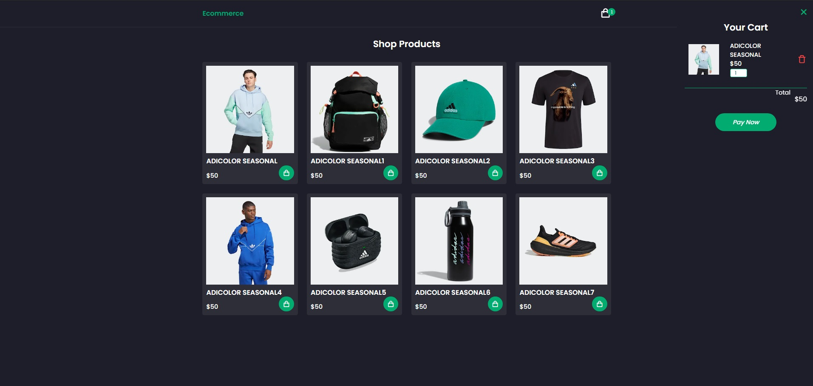
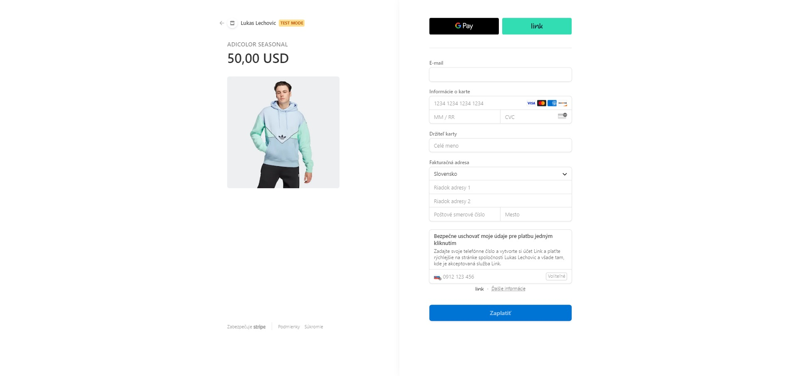

# E-commerce Website

Welcome to the E-commerce Website project! This is a simple e-commerce website template built using HTML, CSS, and JavaScript. It includes a shopping cart functionality and integrates with Stripe for secure payments.

## Table of Contents

- [Overview](#overview)
- [Features](#features)
- [Technologies Used](#technologies-used)
- [Screenshots](#screenshots)

## Overview

This project provides a foundation for building your own e-commerce website. It includes a responsive design, a shopping cart with add/remove functionality, and a seamless integration with Stripe for payment processing.

## Features

- Responsive design
- Shopping cart functionality
- Integration with Stripe for secure payments

## Technologies Used

- HTML
- CSS
- JavaScript
- Node.js
- Express
- Stripe API

## Screenshots

